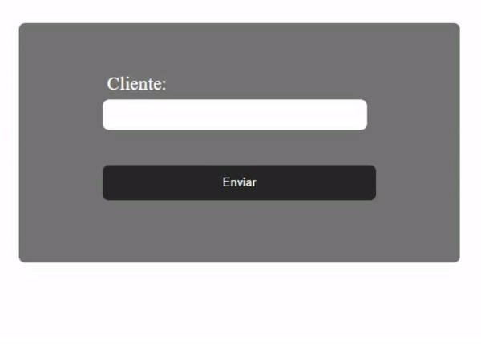
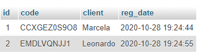
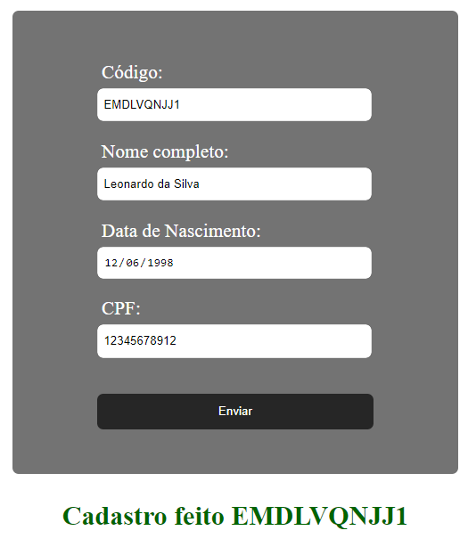
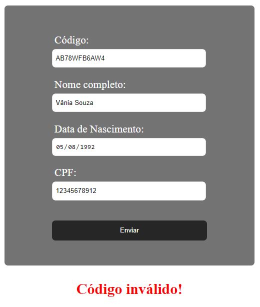
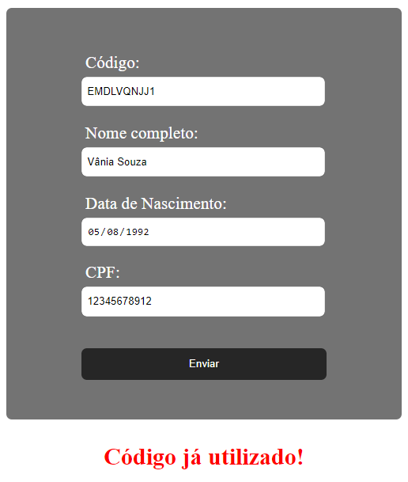
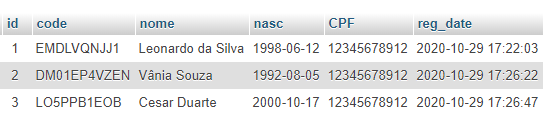

# Codes Raffling
*A small project of raffling using PHP, MySQL, JavaScript, HTML and CSS.*

## Objetivo
#### Desenvolvimento de um sorteador de código simples:
- O sorteador deve , inicialmente, gerar os códigos e inserí-los na tabela do Banco de Dados;
- Para participar do sorteio, o código deve ser válido e não pode ter sido utilizado anteriormente.

Para treinar o uso de diferentes linguagens, utilizei PHP, MySQL, JavaScript, HTML e CSS para o desenvolvimento de todo o sistema.

## Projeto
Inicialmente, o responsável pelo sorteio deverá gerar os códigos do sorteio na página [codecreate.php](codecreate.php). Para este caso, levei em consideração um dono de uma pequena loja online de canecas e brindes. Esse dono, por ter que enviar manualmente todos produtos, decidiu gerar e imprimir os códigos para enviar junto com a venda. Para garantir o controle de suas vendas e códigos gerados, o dono preferiu ter como gerar um código linkado a um nome de um cliente, mesmo que esse cliente não chegue a usar o código. 

#### Tela de Cadastro para gerar os códigos:

Os códigos gerados serão armazenados na tabela criada pelo arquivo [create_table.php](create_table.php) no banco de dados criado pelo [create_db.php](create_db.php).

#### Tabela com códigos gerados e demais informações:

Quanto aos clientes, esses terão acesso à página [register.php](register.php) em que é necessário preencher nome, CPF, data de nascimento e o código válido. 

#

Caso o código seja inválido, ou já tenha sido utilizado anteriormente, o programa também informará e não deixará o cliente participar do sorteio.

 

#

#

Por fim, o dono da loja terá a tabela com os clientes inscritos no sorteio.

#### Tabela com clientes inscritos:

## Próximos passos

- [ ] Fazer página de sorteio, ou integrar o sorteio à página já existente [codecreate.php](codecreate.php);
- [ ] Verificador de CPF com JavaScript;
- [ ] Aprimorar design com CSS;
- [ ] Aplicar sistema de autenticação para diferenciar Cliente de Administrador;
- [ ] \(Obrigue-me, rs) Traduzir o README.md para inglês LOL;
- [ ] \(Sidequest) Descobrir mais coisas para aprimorar.
